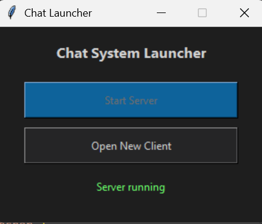
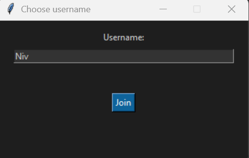
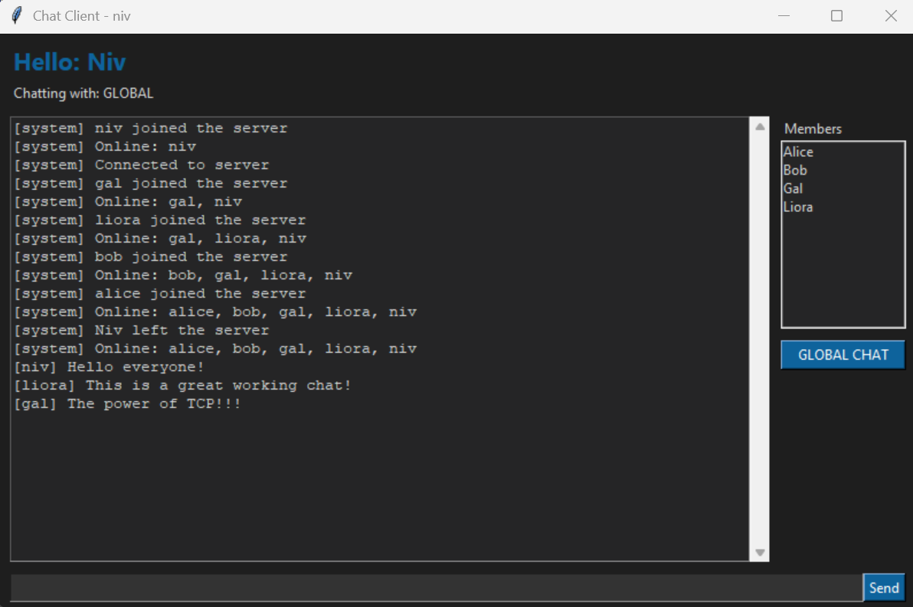

# TCP Client-Server Chat System

This project implements a client-server chat system using Python sockets.

The server manages multiple clients and routes messages between them in real time.  
The project also includes network traffic analysis using Wireshark to study how the chat protocol behaves over TCP.

## Features

• Multi-client chat server  
• Real-time messaging  
• GUI client using Tkinter  
• Private messaging support  
• Network traffic analysis with Wireshark

## 📸 Demo

### 🚀 Chat System Launcher

  

### 👤 Username Selection

  

# Folder descriptions
# src/
Contains the Python source code of the project:
main.py – Launcher for starting the server and opening clients
server.py – TCP server implementation
client_logic.py – Client-side networking and protocol logic
client_ui.py – Graphical user interface (GUI) for the client

# notebooks/
Contains Jupyter notebooks used for Part 1 of the project:
Notebook for loading and processing the CSV input
CSV file with application-layer messages used as input

# wireshark/
Contains network traffic capture files:
Wireshark .pcapng capture used to analyze TCP/IP encapsulation

report/
Contains the final written project report:
PDF document submitted as part of the assignment

## Overview
This project implements a TCP-based client–server chat system.
The server supports multiple clients simultaneously, and each client uses a simple graphical user interface (GUI).

## Requirements
- Python 3.9 or higher
- No external libraries required

## How to Run
1. Run the launcher:
   python main.py
2. Click "Start Server"
3. Click "Open New Client" to launch a client window
   (You may open multiple clients)

## Basic Usage
- Type a message and press Enter to send a global message
- Click on a username to start a private chat (DM)
- To disconnect, use:
/bye

## Notes
- Communication uses 127.0.0.1 (localhost)
- Intended for local execution and Wireshark traffic analysis

### 💬 Real-Time Chat Interface

  

